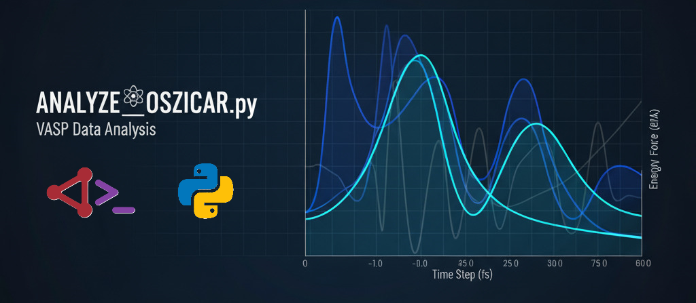

<p align="center">
  
</p>

# OSZICAR Analysis Tool

  

A comprehensive Python script for analyzing VASP **OSZICAR** files from both molecular dynamics (MD) simulations and geometry optimization calculations.

## Tags / Topics

Use these tags as GitHub repository *Topics* and in descriptions so your repo is easier to discover:

`vasp` `oszicar` `materials-science` `dft` `molecular-dynamics` `geometry-optimization` `python` `data-analysis` `plotting`

(You can add them on GitHub under **Settings → Features → Topics** or by editing repository topics on the repo front page.)

---

## Features

* **Automatic Detection**: Automatically identifies whether the OSZICAR file is from MD or geometry optimization.
* **Comprehensive Analysis**: Analyzes both ionic and electronic convergence steps.
* **Visualization**: Generates detailed plots and graphs for data analysis.
* **Multiple Formats**: Supports both spin-polarized and non-spin-polarized calculations.
* **Clean Output**: Organizes results in structured folders with high-resolution plots.

## Requirements

```python
import os
import shutil
import pandas as pd
import numpy as np
import matplotlib.pyplot as plt
import seaborn as sns
import csv
import glob
import re
from pathlib import Path
import plotly.express as px
```

## Installation

1. Clone this repository:

```bash
git clone [your-repo-url]
cd [repo-name]
```

2. Install required dependencies:

```bash
pip install pandas numpy matplotlib seaborn plotly
```

## Usage

### Basic Setup

1. Edit the configuration section at the top of `analyze_oszicar.py`:

```python
# REQUIRED INPUTS
oszicar = 'OSZICAR_MERGED'    # Path to your OSZICAR file
resolution_plots = 300         # DPI for output plots (standard: 300)
```

2. Run the script:

```bash
python analyze_oszicar.py
```

### Supported File Types

The script automatically detects and handles:

* **Geometry Optimization** (5 columns): Spin-polarized structural optimization
* **Molecular Dynamics** (8 columns): Non-spin-polarized MD simulation
* **Molecular Dynamics** (9 columns): Spin-polarized MD simulation

## Output Structure

### For Geometry Optimization

```
├── oszicar_analysis.png          # Main convergence analysis
├── scf_algorithm_comparison.png   # SCF method comparison
├── ionic_analysis.csv            # Detailed ionic step data
└── electronic_analysis.csv       # Electronic convergence data
```

### For Molecular Dynamics

```
├── output_plots/
│   ├── ionic_evolution.png       # Energy, force, temperature evolution
│   ├── scf_convergence.png       # Electronic convergence details
│   ├── scf_steps_per_md_step.png # SCF steps per MD step
│   ├── energy_vs_step.png        # Total energy evolution
│   ├── temperature_vs_step.png   # Temperature tracking
│   ├── force_vs_step.png         # Force evolution
│   ├── kinetic_energy_vs_step.png # Kinetic energy
│   ├── sp_sk_vs_step.png         # SP and SK parameters
│   └── temperature_vs_step.html  # Interactive temperature plot
```

## Analysis Features

### Geometry Optimization Analysis

* **Energy Convergence**: Tracks total energy evolution
* **Force Convergence**: Monitors force reduction
* **Electronic Steps**: Analyzes SCF convergence per ionic step
* **Magnetization**: Tracks magnetic moment changes
* **Algorithm Comparison**: Compares different SCF methods used

### Molecular Dynamics Analysis

* **Thermodynamic Properties**: Temperature, kinetic energy, potential energy
* **Force Analysis**: Force evolution throughout trajectory
* **Electronic Convergence**: SCF steps required per MD step
* **Algorithm Statistics**: Usage statistics for different SCF methods
* **Interactive Plots**: HTML-based interactive temperature plots

## Configuration Options

```python
# System Definition
oszicar = 'OSZICAR_MERGED'     # Input OSZICAR file path
resolution_plots = 300          # Plot resolution (DPI)
```

## File Processing Workflow

1. **Cleanup**: Removes temporary folders and previous output files
2. **File Splitting**: Separates OSZICAR into individual ionic steps
3. **Data Extraction**: Extracts ionic and electronic information
4. **Format Conversion**: Converts to CSV format for analysis
5. **Data Processing**: Cleans and formats numerical data
6. **Analysis**: Performs convergence and statistical analysis
7. **Visualization**: Generates comprehensive plots and graphs

## Output Interpretation

### Geometry Optimization

* **Energy Convergence Plot**: Shows total energy vs ionic steps
* **Force Convergence Plot**: Displays force magnitude reduction
* **Electronic Steps Bar Chart**: Number of SCF steps per ionic step
* **Final Statistics**: Convergence criteria and final values

### Molecular Dynamics

* **Energy Evolution**: Total, kinetic, and potential energy trends
* **Temperature Control**: Temperature stability throughout simulation
* **Force Analysis**: Force fluctuations and averages
* **SCF Efficiency**: Electronic convergence behavior per MD step

## Troubleshooting

### Common Issues

1. **File Not Found**: Ensure the OSZICAR file path is correct
2. **Permission Errors**: Check write permissions for output directories
3. **Memory Issues**: Large OSZICAR files may require more RAM
4. **Plot Generation**: Ensure matplotlib backend is properly configured

### Supported OSZICAR Formats

* **Standard VASP OSZICAR**: Both MD and optimization formats
* **Merged OSZICAR**: Concatenated multiple runs
* **Different Column Counts**: Automatically detected (5, 8, or 9 columns)

## Technical Details

### Data Processing Pipeline

1. **Header Recognition**: Identifies OSZICAR sections using regex patterns
2. **Electronic Step Separation**: Splits based on convergence headers
3. **Ionic Step Extraction**: Extracts F= and T= lines
4. **CSV Conversion**: Standardizes data format
5. **Numerical Cleaning**: Handles floating point formatting
6. **Statistical Analysis**: Calculates convergence metrics

### Algorithm Detection

The script identifies different SCF algorithms used:

* **RMM-DIIS**: Residual minimization method
* **DAV**: Davidson diagonalization
* **CG**: Conjugate gradient method

## Contributing

1. Fork the repository
2. Create a feature branch (`git checkout -b feature/new-analysis`)
3. Commit your changes (`git commit -am 'Add new analysis feature'`)
4. Push to the branch (`git push origin feature/new-analysis`)
5. Create a Pull Request

## License

MIT License - see the [LICENSE](LICENSE) file for details.

## Citation

If you use this tool in your research, please cite:

```
De Vos, S. (2024). OSZICAR Analysis Python Tool.
GitHub repository: https://github.com/stevnBasbak/OSZICAR-Analysis-Python-Tool
```

## Contact

**Stijn De Vos** ([stevnBasbak](https://github.com/stevnBasbak))
Computational Researcher at VUB (Vrije Universiteit Brussel)

For questions, issues, or contributions, please:

* Open an issue on GitHub
* Contact via GitHub profile

---

**Note**: This tool is designed for VASP OSZICAR files. Ensure your input files follow the standard VASP format for proper analysis.
